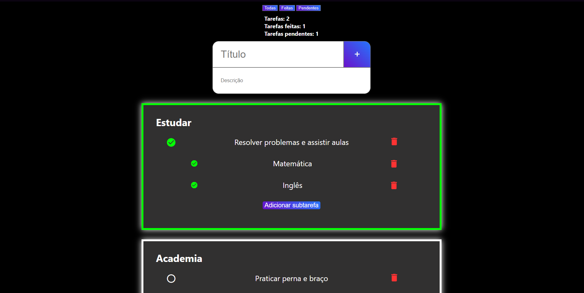

# 📋 Projeto Painel de Tarefas

Uma aplicação web simples de lista de tarefas com suporte a subtarefas, filtros e armazenamento local. Criada com HTML, CSS e JavaScript puro.

---

## 🚀 Funcionalidades

- ✅ Adição de tarefas com título e descrição
- 📝 Subtarefas por tarefa principal
- 🗃️ Armazenamento de dados via LocalStorage
- 🔄 Atualização automática ao recarregar a página
- 🔍 Filtro de tarefas concluídas, pendentes e todas
- 🎯 Contador de tarefas feitas e pendentes

---

---

## 💡 Lógica do Projeto

1. Qual foi sua lógica para estruturar o projeto?

O projeto foi estruturado com foco na criação dinâmica de tarefas e sua persistência no navegador:
- Cada tarefa é armazenada no `localStorage` com seus dados essenciais: título, descrição, subtarefas e status.
- Ao recarregar a página, todas as tarefas são renderizadas novamente com base nos dados salvos.
- Os filtros atuam diretamente sobre esses dados, exibindo somente tarefas concluídas ou pendentes conforme o usuário selecionar.

---

## 🧠 Desafios Encontrados

2. Que parte você achou mais difícil ou travou?

O maior desafio foi implementar o filtro sem quebrar a estrutura de criação dinâmica das tarefas. Isso exigiu uma reestruturação do código e a introdução do `localStorage` como base de dados. Apesar da dificuldade, foi uma experiência divertida e que melhorou a organização geral da aplicação.

---

## 🔧 Melhorias Possíveis

3. O que faria diferente se tivesse mais tempo?

Com mais tempo, eu gostaria de adicionar:
- Ordenação customizada (além da ordenação por ordem de criação)
- Filtro e busca por nome da tarefa
- Suporte a datas de criação e vencimento

---

## 🧩 Para um Projeto Real...

4. O que faria diferente se fosse para um cliente real?

Se esse projeto fosse para um cliente, eu:
- Estruturaria melhor os arquivos
- Comentaria mais o código
- Usaria frameworks ou bibliotecas

---

## 🤖 Uso de Inteligência Artificial

5. Você usou alguma ferramenta ou inteligência artificial para ajudar? Como?

Utilizei o **ChatGPT** para:
- Obter sugestões
- Refatorar e melhorar trechos de código
- Encontrar e corrigir bugs
- Aprender novas formas de estruturar minha lógica em JavaScript

---

## 📷 Preview

---

## 🧑‍💻 Autor

Desenvolvido por Vinícius Miura do Espírito Santo

---
